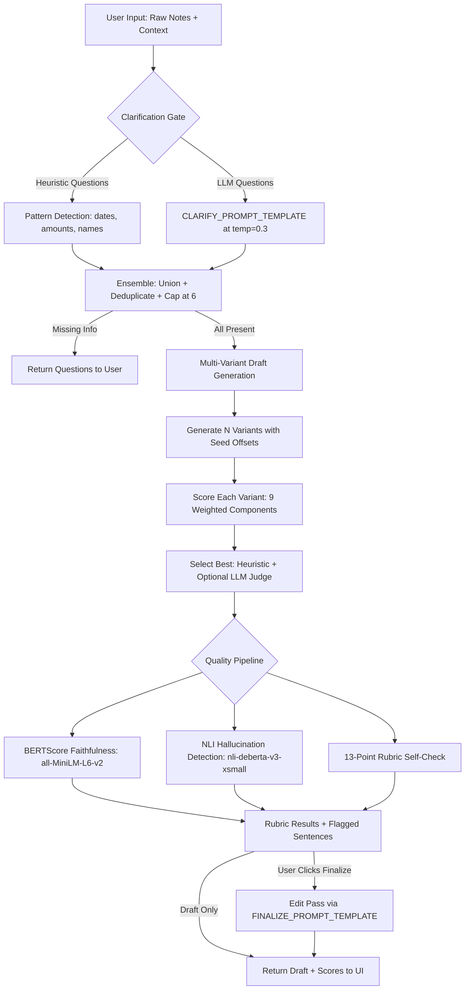

<!--  -->

# Draft-to-Ready Writing Agent

**An AI-powered multi-stage writing agent that transforms messy notes into polished, channel-formatted messages — with built-in quality scoring, faithfulness verification, and hallucination detection.**

This project implements a complete agentic pipeline: clarification gating (heuristic + LLM ensemble), multi-variant draft generation with best-of-N selection, BERTScore-based faithfulness scoring, NLI-powered hallucination detection, a 13-point self-check rubric, and an optional finalize/edit pass. It supports three LLM providers (OpenRouter cloud, Ollama local, deterministic Mock) and three output channels (Email, WhatsApp, Microsoft Teams).

---

## Architecture



---

## Key Design Decisions

### Why Ensemble Clarification (Heuristic + LLM)?
Heuristics catch structured gaps reliably (missing dates via regex, missing amounts via currency patterns) but miss contextual gaps. The LLM catches nuanced missing information but can be overconfident. By requiring **both** to agree before proceeding, we get conservative correctness without over-questioning.

### Why BERTScore over Keyword Matching?
Naive keyword overlap (the original approach) returns 0% when the draft paraphrases the user's notes using different words. BERTScore using `all-MiniLM-L6-v2` measures **semantic** similarity at the sentence level — "I was sick" and "due to illness" score highly even though they share no keywords. A word-overlap fallback is provided when sentence-transformers is unavailable.

### Why NLI for Hallucination Detection?
Natural Language Inference (NLI) using `cross-encoder/nli-deberta-v3-xsmall` classifies each draft sentence as entailed, neutral, or contradicted by the source notes. This catches fabricated details (invented dates, amounts, names) that keyword matching would miss entirely. The model is small (~22M parameters) and runs in <1 second per draft.

### Why Best-of-N with Heuristic + Judge?
Generating multiple variants and scoring them deterministically avoids the randomness problem of single-shot generation. The 9-component weighted scoring formula prioritizes content accuracy (faithfulness ×1.5, hallucination ×1.4) over formatting (closing ×0.5, min length ×0.4). An optional LLM judge can override the heuristic selection for additional quality assurance.

---

## Research References

- **Zhang et al., 2020** — *BERTScore: Evaluating Text Generation with BERT.* ICLR 2020. The foundation for our semantic faithfulness scoring approach using contextual embeddings rather than n-gram overlap.
- **Honovich et al., 2022** — *TRUE: Re-evaluating Factual Consistency Evaluation of Knowledge-Grounded Dialogue.* NAACL 2022. Informs our use of NLI models for hallucination detection, demonstrating that entailment-based evaluation outperforms surface-level metrics for factual consistency.
- **Ensemble Clarification** — Our heuristic + LLM ensemble approach for the clarification gate draws on the principle that combining rule-based and neural systems yields more robust decision-making than either alone, particularly for information completeness verification.

---

## Supported LLM Providers

| Provider | Description | Setup |
|----------|-------------|-------|
| **OpenRouter** (cloud) | Access to Mistral, Llama, Gemma, Qwen via API. Supports streaming. | Set `OPENROUTER_API_KEY` in `.env` |
| **Ollama** (local) | Run models locally with full privacy. No API key needed. | Install Ollama + pull a model |
| **Mock** (demo) | Deterministic responses for testing and demo. No setup required. | Default fallback |

---

## Live Demo

**[Try it live on Hugging Face Spaces](https://huggingface.co/spaces/InfectedDuck/Draft-to-ready-writing-agent)**

---

## Setup

1. **Install Python 3.11+**
2. **Create and activate a virtual environment:**
   ```bash
   python -m venv .venv
   # Windows PowerShell:
   .\.venv\Scripts\Activate.ps1
   # Linux/macOS:
   source .venv/bin/activate
   ```
3. **Install dependencies:**
   ```bash
   pip install -r requirements.txt
   ```
4. **Configure LLM provider** (optional):
   ```bash
   # For OpenRouter (cloud):
   echo "OPENROUTER_API_KEY=sk-or-v1-your-key-here" > .env

   # For Ollama (local):
   ollama pull mistral:7b-instruct-q4_0
   ```
5. **Run:**
   ```bash
   python app.py
   ```
   Open the URL shown in terminal (default: `http://localhost:7860`).

---

## Docker

Run the full stack (app + Ollama) with one command:
```bash
docker-compose up
```

Build just the app:
```bash
docker build -t draft-to-ready .
docker run -p 7860:7860 draft-to-ready
```

---

## Evaluation Harness

```bash
# Default (mock client, no LLM needed):
python evals/run_evals.py --mock

# With Ollama:
python evals/run_evals.py --use-ollama --model mistral:7b-instruct-q4_0

# Hard cases:
python evals/run_evals.py --cases evals/cases_hard.json
```

Results: terminal summary + `evals/last_results.json`.

### Visual Dashboard
```bash
python -m evals.dashboard
```
Opens on port 7861 with pass rates, scoring analysis, case details, and comparison tabs.

### Calibrate Scoring Weights
```bash
python evals/calibrate_scoring_weights.py
```

---

## Scoring Formula

Each draft variant is scored by a weighted sum of 9 components, sorted by importance:

| Component | Weight | Range | Description |
|-----------|--------|-------|-------------|
| Faithfulness | ×1.5 | 0.0–1.0 | Semantic similarity between notes and draft |
| Hallucination | ×1.4 | ≤0 | -1.0 per fabricated detail |
| Intent Coverage | ×1.2 | 0.0–1.0 | Required details (dates, amounts) present |
| Tone Match | ×1.1 | 0.0–1.0 | Style-preset marker ratio |
| Next Step | ×0.9 | -0.5–1.5 | Actionable phrases for preset |
| Subject Line | ×0.8 | -1.0–0.7 | Channel-appropriate compliance |
| Word Count | ×0.6 | -1.5–1.0 | Target range fit |
| Closing | ×0.5 | -0.5–1.0 | Sign-off presence |
| Min Length | ×0.4 | -1.0–0.8 | ≥40 words sanity check |

Weights are configurable via `evals/scoring_weights.json`.

---

## Environment Variables

| Variable | Default | Description |
|----------|---------|-------------|
| `OPENROUTER_API_KEY` | — | OpenRouter API key (required for cloud provider) |
| `OPENROUTER_MODEL` | `mistralai/mistral-7b-instruct` | OpenRouter model name |
| `OLLAMA_MODEL` | `mistral:7b-instruct-q4_0` | Ollama model tag |
| `OLLAMA_BASE_URL` | `http://localhost:11434` | Ollama server URL |
| `AGENT_JUDGE_ENABLED` | `0` | Enable LLM-based draft judge |
| `LLM_CLARIFY_ENABLED` | `1` | Enable LLM clarification ensemble |
| `HALLUCINATION_THRESHOLD` | `0.3` | Hallucination score warning threshold |

---

## CI

GitHub Actions runs on every push/PR to `main`:
- **lint** — `ruff check .`
- **test** — `pytest tests/ -v`
- **eval** — `python -m evals.run_evals --mock`
- **docker-build** — verify image builds

---

## License

MIT
